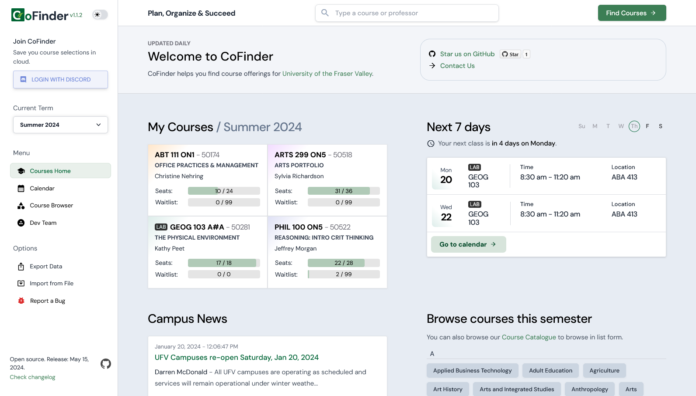

# CoFinder

CoFinder helps you find course offerings for University of the Fraser Valley.

**Use Now**: [https://cofinder.ca](https://cofinder.ca)

## Gallery

1. Homepage
   

2. Weekly Calendar
   

3. Course Browser
   

## Run locally

### Frontend

Vite with React is used for the entire application. Check [frontend/README.md](frontend/README.md) for more information.

### Backend

For backend, Django (Python) is used. You can find how to use it in [backend/README.md](backend/README.md).

## License

Creative Commons Attribution-NonCommercial-NoDerivatives 4.0 International Public License. Read [LICENSE.md](LICENSE.md) for details.
